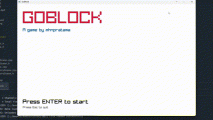

# GoBlock

An old-school block destroyer game.



## Dependency

1. [Conan](https://docs.conan.io/2.0/reference/commands/install.html)
2. [CMake]()
3. [Raylib](https://www.raylib.com/)
4. [Flecs](https://www.flecs.dev/)

## Installation

1. Clone
2. `cd goblock`
3. Install all deps using Conan

```shell
conan install . --output-folder=build --build=missing --settings=compiler.cppstd=17
```

4. Configure CMake

```shell
mkdir build
cd build
cmake .. -DCMAKE_TOOLCHAIN_FILE=conan_toolchain.cmake
```

5. Build

```shell
cmake --build . --config Release
```

6. Enjoy!

```shell
./Release/goblock.exe
```

---

## Controls

- `A D` : movement 

---

## Objective

Destroy all the blocks

---

### License

Open-source

---

#### 💖 Created special for [Ifa](https://www.linkedin.com/in/qhoifa-fawziah-aulia-keysha/)
